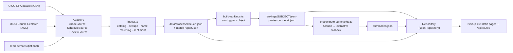

<h1 align="center">ProfPeek</h1>

<p align="center"><strong>Find the professor, not just the course.</strong><br/>
Official grade curves + student reviews, filtered to the sections you can still get into this term.</p>

<p align="center">
  <a href="https://profpeek-W3313.vercel.app">Live demo</a> ·
  <a href="https://github.com/W3313/profpeek/actions/workflows/ci.yml"></a> ·
  <a href="#data-sources--licensing">Data & licensing</a> ·
  <a href="https://profpeek-W3313.vercel.app/about">How it works</a>
</p>


> **Demo data is fictional.** Every professor, review, per-instructor grade row and open section in the demo is generated by a seeded script. Course titles and course-level grade shapes come from the public UIUC GPA dataset. [Why](#why-the-demo-data-is-fictional).

## What it does

The 60-second tour:

1. **Rank professors in a subject by the number that matters** — a shrinkage-adjusted rating, with confidence dots, so one 5-star review cannot win. Sort by Overall, Grades or Reviews instead with one tap.
2. **See the grade curve each professor actually gave**, compared with the same course taught by others (leave-one-out delta), never a raw GPA across course levels.
3. **Filter to sections you can still get into** — the schedule snapshot is joined to each professor, so "Open seats only" is the default and closed sections are one toggle away.
4. **Read a structured AI summary** with strengths, watch-outs, workload and a "Why this?" link to the exact reviews it used. Claude wrote it when a key was present; a deterministic extractive fallback wrote it otherwise, and the source pill says which.
5. **Audit the join.** `/about#matching` shows the name-matching tiers, coverage stats and a filterable table of every instructor string and how it was resolved.

## Try it in 30 seconds

```bash
git clone https://github.com/W3313/profpeek.git && cd profpeek
npm ci
npm run dev          # http://localhost:3000 — zero keys, zero network: the demo dataset is committed
```

Optional, to regenerate the AI summaries with Claude:

```bash
ANTHROPIC_API_KEY=sk-ant-… npm run data:summaries -- --force
```

Requires Node ≥ 22 (`.nvmrc` says 26). Nothing else to install.

## Why the demo data is fictional

The core join in this app is **by name**: a grade row says `"Okonkwo, A"`, the schedule says `" Okonkwo, A"`, the review source says `{ firstName: "Adaeze", lastName: "Okonkwo" }`. Any fuzzy join can be wrong, and a wrong join would attach reviews to a real person who never received them. Fabricated reviews next to real names would be worse: a plausible-looking page saying invented things about a real instructor.

So the demo fabricates the people too.

- **Real:** the UIUC subject and course catalogue, course titles, course-level GPA shapes and typical section sizes (all derived from the public dataset), and the whole pipeline — the demo grade file is written in the dataset's exact 23-column CSV shape so the real parser runs end to end.
- **Fictional:** every professor name, every review, every per-instructor grade row, every section, CRN, room and seat state. Generated names are hashed and checked against a list of hashed real-instructor keys and re-rolled on collision; no real name is stored in the repository.
- **Guarded:** `DATA_MODE=live` with the demo review source is a hard error in `src/lib/sources/registry.ts` ("Refusing to join real instructors with fictional reviews"). Live outputs are gitignored.
- **Badged:** every demo page shows "DEMO DATA — fictional professors & reviews" in the header, every fictional professor is captioned, and `/about#demo` carries the full statement.

## Architecture

Sources → adapters → ingest (matching) → processed JSON → repository → static pages and API routes, with a precompute-summaries side-car. Full diagrams in [`docs/architecture.md`](docs/architecture.md).



The deployed app never calls an upstream source or an LLM. Everything is computed once, committed, and diffed in CI.

## How the numbers work

All formulas are in `src/lib/scoring/` and printed with their constants on `/about#scoring`. Constants: `MIN_REVIEWS_RANKED = 3`, `MIN_GRADED_N = 10`, `MIN_BASELINE_N = 10`, `MIN_BADGE_N = 50`, `SHRINK_K = 5`, `PRIOR_FALLBACK = 3.7`.

**Rating with Bayesian shrinkage**

```
ratingShrunk = (reviewCount × ratingRaw + SHRINK_K × priorMean) / (reviewCount + SHRINK_K)
```
`priorMean` is the mean quality of every review in the subject (3.7 when the subject has < 20 reviews). Three 5-star reviews with a 3.7 prior → (3×5 + 5×3.7) / 8 = **4.19**, not 5.0.

**Leave-one-out course delta ("vs course")**

```
delta_c  = gpa_c(P) − weighted GPA of every OTHER headline row in course c   (needs ≥ 10 students on both sides)
gpaDelta = Σ n_c(P) × delta_c / Σ n_c(P)                                    deltaComparableN = Σ n_c(P)
```
P taught CS 225 (200 students, 3.40 vs others' 3.10) and CS 374 (100 students, 2.90 vs 3.00) → (200×0.30 + 100×(−0.10)) / 300 = **+0.167**. Comparing within the same course is what stops a 100-level instructor from looking "easier" than a 400-level one. If nobody else taught the course in the window the chip reads "only instructor on record" instead of a misleading +0.00.

**Composite ("Overall"), 0–100**

```
R = (ratingShrunk − 1) / 4
G = gpaDelta === null ? 0.5 : clamp((gpaDelta + 0.75) / 1.5, 0, 1)
W = wouldTakeAgainPct === null ? 0.5 : wouldTakeAgainPct / 100
composite = round1(100 × (0.60·R + 0.25·G + 0.15·W))
```
ratingShrunk 4.2, delta +0.15, would-take-again 80 % → 100 × (0.48 + 0.15 + 0.12) = **75.0**.

**Suppression and headline rows.** Rows with fewer than 10 graded students are excluded from every aggregate (kept for provenance). Discussion/lab rows (`DIS, LAB, LBD, OLB, Q`) are TA-led and excluded from headline stats; they appear only behind a toggle on the detail page. Grade rows are limited to a 6-year window.

**Badges** (first 3 that hold, in this order): Open now · Tough but loved (delta ≤ −0.15 and rating ≥ 4.2, 50+ students) · Easy A (delta ≥ +0.25, 50+ students) · Hidden gem (raw ≥ 4.5 with 3–7 reviews) · Low withdrawal (W-rate ≤ half the subject's, subject W-rate ≥ 2 %).

## Name matching

`src/lib/matching/` — pure, deterministic, memoized, tested against a 29-row table of fictional edge cases. Scores are evaluated top to bottom; first hit wins.

| Tier | Method | Condition | Score |
|---|---|---|---|
| T0 | `alias` | manual override file maps the exact raw string to a professor id | 1.00 |
| T1 | `exact` | same compact surname and the same full first name (diacritics, hyphens, apostrophes, suffixes ignored) | 1.00 |
| T2 | `first-token` | same surname, same first token (both ≥ 2 letters) | 0.95 |
| T3 | `initial` | same surname, one side is a bare initial that agrees | 0.85 |
| T4 | `nickname` | same surname, first names in the same nickname group (25 groups) | 0.85 |
| T5 | `compound-last` | surnames share the final token or one is a prefix/suffix (≥ 4); first names satisfy T1/T2 | 0.80 |
| T6 | `fuzzy` | surnames one edit apart (incl. transposition), both ≥ 6 letters; first names satisfy T1/T2 | 0.75 |

Differing middle initials halve the score. Within a scope (grades: subject → school; schedule: course → subject → school) the best candidate must clear 0.75 (0.85 school-wide) **and** beat the runner-up by 0.10; an ambiguity stops the search and the string becomes a separate grades-only entry rather than a guess.

Ingest prints a coverage line, for example `matched 19/20 instructor strings (95.0%) · 0 ambiguous · 1 unmatched · 1 blocked · sections linked 11/12`, fails in demo mode below 60 %, and writes `data/processed/uiuc/match-report.json`, rendered at `/about#matching` and uploaded as a CI artifact.

## AI summaries

- **Structured output:** `client.messages.parse` with a zod output format — `verdict`, `teachingStyle[]`, `strengths[]`, `watchOuts[]`, `bestFor`, `workload`, `format`, `confidence`, `evidenceReviewIds[]` — all length-capped.
- **Evidence validation:** every `evidenceReviewIds` entry must be one of the reviews the model was shown, or the whole output is discarded. `confidence` is overwritten from the review count. The **grading note is always generated by code** from the grade aggregates, so the model never states a GPA.
- **Balanced input by construction:** the 10 most recent ∪ 10 most helpful ∪ 10 lowest-rated reviews, capped at 30, each ≤ 600 chars.
- **Extractive fallback:** no key, refusal, exhausted rate-limit retries or a validation failure all produce a deterministic summary in the same schema from top-scoring review sentences and vibe-tag phrases. Snapshot-tested.
- **Cost:** summaries are precomputed by `npm run data:summaries` and committed. One full run over the ~90 demo professors at effort `low` is on the order of 150–250k input tokens and ~30k output tokens; the script prints an estimate before it starts and usage totals when it finishes. The deployed app never calls the API.

### Free model option: Groq (or Ollama, OpenRouter)

You do not need a paid key. The same script can use any OpenAI-compatible chat endpoint; Groq's free tier is the default:

```bash
# .env.local
GROQ_API_KEY=gsk_...            # free at https://console.groq.com/keys
# optional: GROQ_MODEL=openai/gpt-oss-20b (list current ids with `curl https://api.groq.com/openai/v1/models -H "Authorization: Bearer $GROQ_API_KEY"`)  GROQ_BASE_URL=https://api.groq.com/openai/v1
npm run data:summaries -- --force   # regenerates every summary with Groq, then rebuilds the rankings payloads
```

Provider resolution (`SUMMARY_PROVIDER=auto`): Claude if `ANTHROPIC_API_KEY` is set, else Groq if `GROQ_API_KEY` is set, else the extractive fallback. The source pill shows "Groq · openai/gpt-oss-20b". To use a local model instead, run Ollama and set `GROQ_BASE_URL=http://localhost:11434/v1`, `GROQ_MODEL=qwen3:8b`, `GROQ_PROVIDER_NAME=Ollama` and any non-empty `GROQ_API_KEY`.

**Free-tier budget.** Groq's free tier allows about 8,000 tokens per minute and roughly 200,000 tokens per day per model; one summary costs about 2,500 tokens, so a full run of 86 professors takes ~30 minutes and may hit the daily cap near the end. Professors that fall back to the extractive summary are upgraded automatically by the next plain `npm run data:summaries` run (it regenerates only entries that are not model-written), so a large batch can simply be finished the next day. The default model is `openai/gpt-oss-20b`; `openai/gpt-oss-120b` is stronger but has the same budget. Each model has its own daily budget, so when one runs out you can finish the batch on another (`GROQ_MODEL=qwen/qwen3.8-27b npm run data:summaries`): every summary records the model that wrote it, the source pill shows it, and `/about` lists the models used. Rerun with `--force` on a fresh day to make the whole set uniform again.

The deployed site keeps serving the committed summaries with no key at all. If you also want it to generate summaries for professors that have none (live mode), set `GROQ_API_KEY` and `SUMMARY_ON_DEMAND=1` in the host's environment; results are returned but never written (read-only filesystem), and each uncached view spends free-tier quota.

## Live mode

```bash
cp .env.example .env.local
# set DATA_MODE=live, REVIEW_SOURCE=none (or rmp + RMP_ENABLED=1), CURRENT_TERM=2026-fa, SUBJECTS=CS,ECE
npm run data:live     # fetch GPA CSV → fetch schedule → ingest → rankings, into data/processed/uiuc-live (gitignored)
```

- **Course Explorer request topology** per subject: `GET /{year}.xml` (term list) → `GET /{year}/{season}/{SUBJECT}.xml` (course list) → one `?mode=cascade` request per course (≈150 for CS). Concurrency `SCHEDULE_FETCH_CONCURRENCY=4`, `SCHEDULE_FETCH_DELAY_MS=100`, 8 s timeout, 3 retries, on-disk cache under `data/raw/uiuc/{year}-{season}/{SUBJECT}/` (gitignored). A 404 course means "not offered". If the requested term is not published yet the adapter falls back to the latest published term and the UI says so.
- **No seat status.** The public API reports whether a section is *active*, not whether it has seats, so live mode relabels the toggle to "Offered this term" and the term pill states the caveat.
- **Reviews are opt-in.** The RateMyProfessors adapter uses an unofficial endpoint, is off by default, never runs in CI, fails soft (returns `[]`), and its output is never committed. If you enable it, you are responsible for complying with that site's terms of service. Nothing scraped is committed to this repository.

## Data sources & licensing

| Source | What | License / attribution |
|---|---|---|
| [UIUC GPA dataset](https://github.com/wadefagen/datasets) (`wadefagen/datasets`) | per-term, per-course, per-instructor grade distributions, 2010 → present | MIT. "GPA data from the UIUC GPA dataset by Wade Fagen-Ulmschneider." |
| [UIUC Course Explorer](https://courses.illinois.edu/cisapp/explorer/schedule) | sections, meeting times, instructors per term (public XML API) | No license asserted; attribution "Data from the University of Illinois Course Explorer". |
| Demo data (`data/raw/demo`, `data/processed/uiuc`) | fictional professors, reviews, grade rows, sections | MIT (this repository). |
| This repository | code | MIT — see [`LICENSE`](LICENSE). |

The only trace of real instructors in the repo is `data/config/uiuc/real-instructor-keys.json`, a list of truncated hashes used solely so generated names never collide with a real one.

## Setup

```bash
cp .env.example .env.local     # every variable is documented there; defaults work with no edits
```

| Variable | Default | Purpose |
|---|---|---|
| `DATA_MODE` | `demo` | `demo` reads the committed dataset; `live` runs the real adapters into `data/processed/uiuc-live`. |
| `CURRENT_TERM` | `2026-fa` | Term the rankings are built for. |
| `SUBJECTS` | `CS,ECE,MATH,PHYS,STAT,CHEM` | Subjects to seed / ingest. |
| `GRADE_YEARS_BACK` | `6` | Grade window. |
| `DEMO_SEED` | `20260903` | PRNG seed; changing it changes the committed dataset. |
| `ANTHROPIC_API_KEY` | unset | Only read by `data:summaries`; absent → extractive summaries. |
| `ANTHROPIC_MODEL` | `claude-opus-5` | Model for `messages.parse`. |
| `SUMMARY_PROVIDER` | `auto` | `auto` \| `claude` \| `openai-compatible` \| `extractive` |
| `GROQ_API_KEY` | (unset) | Free Groq key; enables the OpenAI-compatible provider |
| `GROQ_BASE_URL` | `https://api.groq.com/openai/v1` | Any OpenAI-compatible endpoint (Ollama: `http://localhost:11434/v1`) |
| `GROQ_MODEL` | `openai/gpt-oss-20b` | Model id for that endpoint |
| `GROQ_PROVIDER_NAME` | `Groq` | Name shown in the source pill |
| `SUMMARY_ON_DEMAND` | `0` | `1` lets the summary route call the model when nothing valid is cached |
| `SUMMARY_SERVER_FALLBACKS`, `MAX_SUMMARIES` | `0`, `500` | Optional refusal-fallback beta; run-size guard. |
| `REVIEW_SOURCE`, `RMP_ENABLED`, `RMP_SCHOOL_ID`, `RMP_AUTH_HEADER` | `demo`, `0`, unset, public token | Review adapter selection (live only). |
| `UIUC_GPA_CSV_URL`, `UIUC_COURSE_EXPLORER_BASE` | upstream URLs | Override for mirrors / fixtures. |
| `SCHEDULE_FETCH_CONCURRENCY`, `SCHEDULE_FETCH_DELAY_MS` | `4`, `100` | Politeness settings for the schedule fetch. |
| `NEXT_PUBLIC_SITE_URL` | `http://localhost:3000` | Canonical URLs, sitemap, OG images. |
| `SMOKE_BASE_URL` | unset | Enables `tests/smoke` against a running server. |

Pipeline commands:

| Command | Does |
|---|---|
| `npm run data:seed` | Generate the fictional raw dataset into `data/raw/demo/uiuc` (deterministic; writes `seed-hash.txt`). |
| `npm run data:ingest` | Parse, dedupe, **match names**, compute sentiment/tags → `data/processed/uiuc/*.json` + `match-report.json`. |
| `npm run data:rankings` | Score every subject → `rankings/<SUBJECT>.json`, `professors-detail.json`. |
| `npm run data:summaries -- [--only-missing\|--force\|--extractive]` | Precompute AI summaries → `summaries.json`. |
| `npm run data:all` | seed → ingest → rankings → summaries `--only-missing` (what CI runs). |
| `npm run data:fetch` / `data:schedule` / `data:live` | Live-mode downloads and the full live pipeline. |

## API

Every route is read-only, cache-friendly and served from the committed JSON.

```bash
curl -s localhost:3000/api/health | jq .
curl -s localhost:3000/api/schools | jq .
curl -s localhost:3000/api/schools/uiuc/subjects | jq '.subjects[:3]'
curl -s 'localhost:3000/api/schools/uiuc/rankings?subject=CS&sort=gpa&open=1' | jq '.ranked[0]'
curl -s 'localhost:3000/api/schools/uiuc/rankings?subject=CS&course=225' | jq '.totals'
curl -s localhost:3000/api/schools/uiuc/courses/CS/225 | jq '.ranked | length'
curl -s localhost:3000/api/schools/uiuc/professors/<slug> | jq '.scores'
curl -s localhost:3000/api/schools/uiuc/professors/<slug>/summary | jq '.summary.verdict'
curl -s 'localhost:3000/api/schools/uiuc/sections?subject=CS' | jq '.sections[0]'
curl -s 'localhost:3000/api/schools/uiuc/match-report?method=initial' | jq '.coverage'
```

## Testing & CI

```bash
npm run lint && npm run typecheck && npm test        # eslint, tsc --noEmit, vitest
npm run test -- --coverage                            # v8 coverage over src/lib/**, 80 % line threshold
SMOKE_BASE_URL=http://localhost:3000 npx vitest run tests/smoke
```

- `tests/unit/` covers every formula with hand-computed expectations, all 29 matching rows, the CSV/XML parsers on committed fixtures, seed determinism (two in-memory runs → identical bytes → equals `seed-hash.txt`), extractive snapshots, mocked-Claude paths (refusal, bad evidence id, rate limit) and the < 200 KB / < 8 MB size budgets.
- `tests/components/` renders `ProfessorCard`, `AISummaryPanel`, `EmptyState` and `HeroForm` in jsdom.
- **Seed-diff guard:** CI runs `npm run data:all` with no API key and then `git diff --exit-code -- data`, so the committed dataset must equal what the generator produces from source. Committed Claude summaries survive because `--only-missing` keeps valid cache entries.
- [`.github/workflows/ci.yml`](.github/workflows/ci.yml): lint → typecheck → test with coverage → data:all → diff → build → start + smoke test → upload `match-report.json`. No secrets are configured.

## Performance & accessibility

- Rankings pages are static HTML; client JS is limited to the controls bar, the ranked list (expand state, sort/filter over the precomputed payload) and the shortlist drawer. No chart library on the rankings page — hand-rolled SVG. `rankings/<SUBJECT>.json` < 200 KB each.
- Targets: LCP < 2.5 s, CLS < 0.1, < 150 KB gzipped JS on `/s/uiuc/CS`.
- Native `<details>/<summary>` for expandable cards (no JS needed to open them); tooltips are `<button aria-describedby>` toggles that close on Escape; charts are `role="img"` with an aria-label and a visually-hidden table; every interactive element has a visible focus ring; contrast ≥ 4.5:1 in light and dark.
- Grade colours are the colour-blind-safe Okabe–Ito sequence (A+ `#004c8c` … F `#d55e00`, W `#8c8c8c`) with text labels on hover/focus.

## What I'd do next

- **Swap the JSON repository for Postgres** (Drizzle) behind the existing `Repository` interface — pages and API routes would not change.
- **A second school** — the adapter interfaces and `SCHOOL_REGISTRY` are already multi-school; the work is one grade source, one schedule source and a departments map.
- **An official seat-count feed** so "open" can be verified in live mode instead of "offered".
- **Per-term diffing of grade rows** to show how a professor's curve moves term over term, not just year over year.
- **Auth-free "pin to compare" links** — the compare page already takes slugs in the URL; pinning would make them shareable snapshots with a dataset hash.

## Deploying to Vercel

- Import the repo; no environment variables are required for the demo (set `NEXT_PUBLIC_SITE_URL` to the deployed origin for correct canonical URLs and OG images).
- `next.config.ts` sets `outputFileTracingIncludes` for `data/processed/**` so the API route handlers can `fs.readFile` the JSON in the serverless bundle; pages are fully static and read at build time. The filesystem is never written to at runtime.
- Keep `data/processed/uiuc` under 8 MB (enforced by `tests/unit/dataSize.test.ts`).

## Tech stack

Next.js 16 (App Router, static generation) · React 19 · TypeScript 5 (strict) · Tailwind v4 · zod · csv-parse · fast-xml-parser · recharts (detail page only) · @anthropic-ai/sdk structured outputs · vitest 5 + Testing Library · ESLint 9 · GitHub Actions · Vercel.

Made by [William Li](https://github.com/W3313). MIT licensed — see [`LICENSE`](LICENSE).
