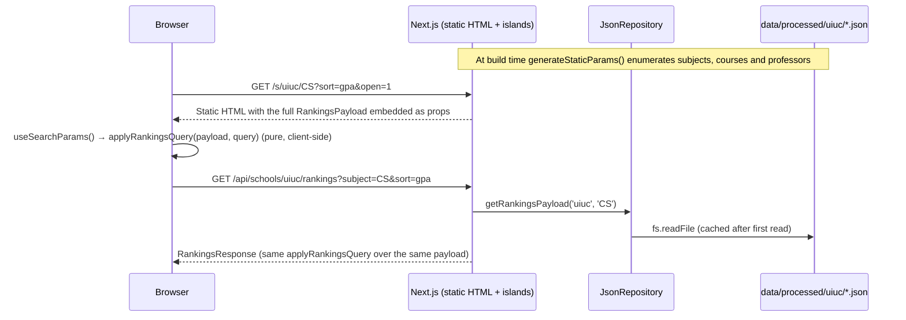
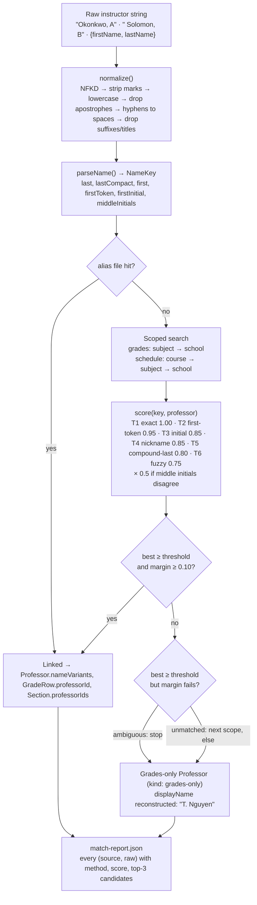

# Architecture

ProfPeek is a build-time data pipeline plus a static Next.js site. Nothing upstream is called at request time: every page is generated from committed JSON, and the API routes read the same files with `fs`.

## System overview

```mermaid
flowchart LR
  subgraph Sources["Upstream sources"]
    GPA["UIUC GPA dataset<br/>(CSV, MIT)"]
    CE["UIUC Course Explorer<br/>(XML API)"]
    RMP["RateMyProfessors<br/>(opt-in adapter, wired to no school)"]
  end

  subgraph Adapters["src/lib/sources (GradeSource · ScheduleSource · ReviewSource)"]
    A1["UiucGpaCsvSource"]
    A2["CourseExplorerSource"]
    A3["RmpReviewSource / NullReviewSource"]
  end

  GPA --> A1
  CE --> A2
  RMP --> A3

  REG["registry.ts<br/>per-school adapter kinds resolved from SchoolConfig.sources"]
  A1 & A2 & A3 --> REG

  ING["scripts/ingest.ts<br/>catalog → sections dedupe → professors → <b>name matching</b> → sentiment & tags"]
  REG --> ING

  subgraph Processed["data/processed/uiuc (committed, < 5 MB)"]
    P1["school · subjects · courses · professors"]
    P2["grades · sections · reviews"]
    P3["match-report.json"]
    P4["meta.json (datasetHash, mode, seed)"]
  end
  ING --> P1 & P2 & P3 & P4

  RANK["scripts/build-rankings.ts<br/>Section 8 scoring per subject"]
  P1 & P2 --> RANK
  RANK --> R1["rankings/&lt;SUBJECT&gt;.json (< 200 KB)"]
  RANK --> R2["professors-detail.json"]

  SUM["scripts/precompute-summaries.ts<br/>Claude structured output → extractive fallback"]
  R2 --> SUM
  SUM --> S1["summaries.json (inputHash-keyed)"]

  REPO["Repository interface<br/>JsonRepository (fs + in-memory cache)"]
  R1 & R2 & S1 & P1 & P3 & P4 --> REPO

  subgraph App["Next.js 16 App Router"]
    PAGES["Static pages<br/>/ · /s/[school]/[subject] · /s/…/[number] · /p/[school]/[slug] · /compare · /about"]
    API["Route handlers<br/>/api/health · /api/schools/… (rankings, courses, professors, sections, match-report)"]
    CLIENT["Client islands<br/>ControlsBar · RankedList · ShortlistDrawer<br/>applyRankingsQuery(payload, query)"]
  end
  REPO --> PAGES & API
  PAGES --> CLIENT
```

## Request-time data flow

## Name matching (the join)

## Module map

| Layer | Path | Notes |
|---|---|---|
| Contracts | `src/lib/domain/types.ts`, `src/lib/sources/types.ts`, `src/lib/repo/Repository.ts` | Verbatim from the spec; every other module codes against these. |
| Config | `src/lib/config/{env,schools,serverOnly}.ts` | zod-validated env; `SCHOOL_REGISTRY` for multi-school. |
| Adapters | `src/lib/sources/{uiuc,purdue,uh,rmp}/`, `registry.ts`, `adapters.ts` | One class per upstream, registered by kind; the registry resolves each school's `SchoolConfig.sources` (see `MULTI_SCHOOL_DESIGN.md`). |
| Matching | `src/lib/matching/` | Pure, memoized, deterministic; tested against the 29-row spec table. |
| Scoring | `src/lib/scoring/` | Row stats, aggregates, shrinkage, composite, badges, sentiment, vibe tags, sort/filter. |
| AI | `src/lib/ai/` | Prompt, schema, review selection, Claude call, extractive fallback, hash cache. |
| Repository | `src/lib/repo/` | `Repository` interface + `JsonRepository`; swap for a DB without touching pages. |
| Pipeline | `scripts/` | `fetch-uiuc-gpa`, `fetch-uiuc-schedule`, `fetch-purdue`, `fetch-uh`, `ingest`, `build-rankings`, `precompute-summaries` (idle until a school has reviews). |
| UI | `src/app/`, `src/components/` | Server components read the repository; islands receive serialized props. |

## Design decisions

- **Build-time everything.** The deployed app has zero runtime dependency on any upstream. Upstream outages, rate limits and schema changes are ingest-time problems caught by tests and CI, never a broken page.
- **A single `Repository` seam.** Pages and API routes only ever call `getRepository()`. The JSON implementation is enough for one school and a few thousand rows; a Postgres implementation slots in behind the same interface.
- **Committed datasets.** Every school's processed data is fetched and rebuilt deliberately (`npm run data:real`) and committed with wall-clock stamps; CI typechecks, tests against those files and builds — it no longer regenerates data.
- **Conservative joins.** The matcher prefers a split record over a wrong one, and every decision is written to `match-report.json` and rendered on `/about#matching`.
- **No fictional people.** The fictional demo school was removed on 2026-09-06; every professor in the repository is a real instructor from official grade records, and ingest fails if any source reports `isFictional: true`. Because the join is by name, no fabricated review may ever sit next to one of them — no school has a review source until first-party reviews ship.
